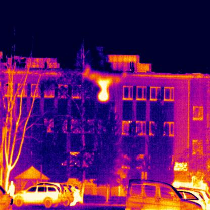
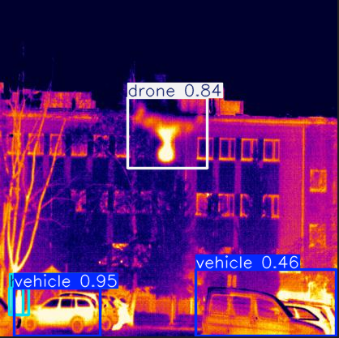
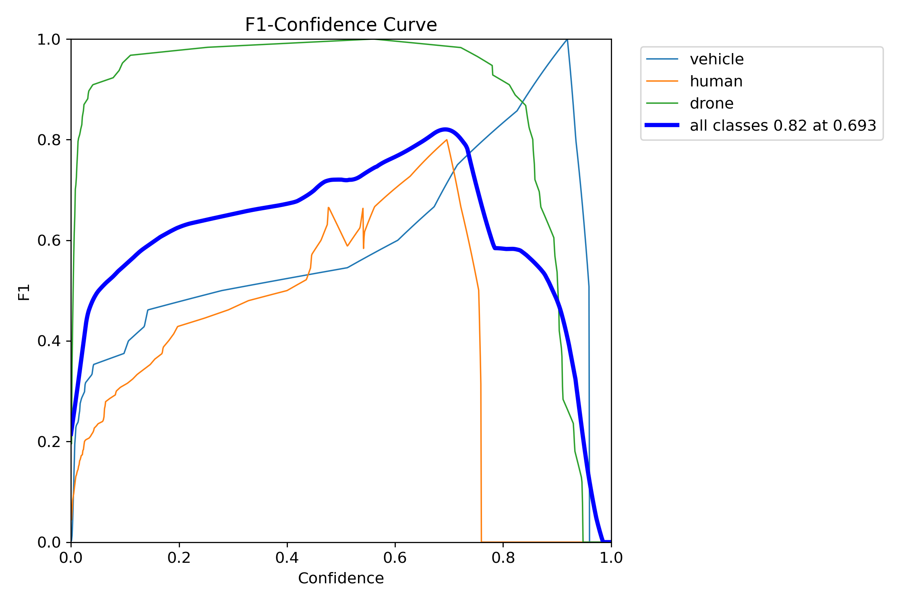
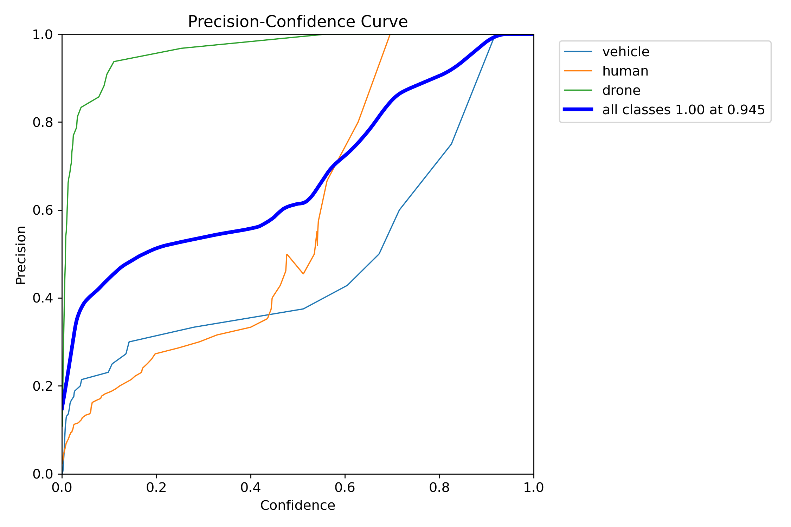
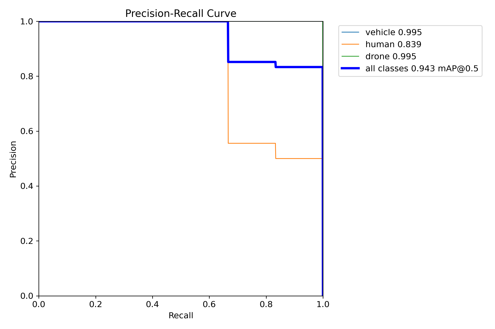
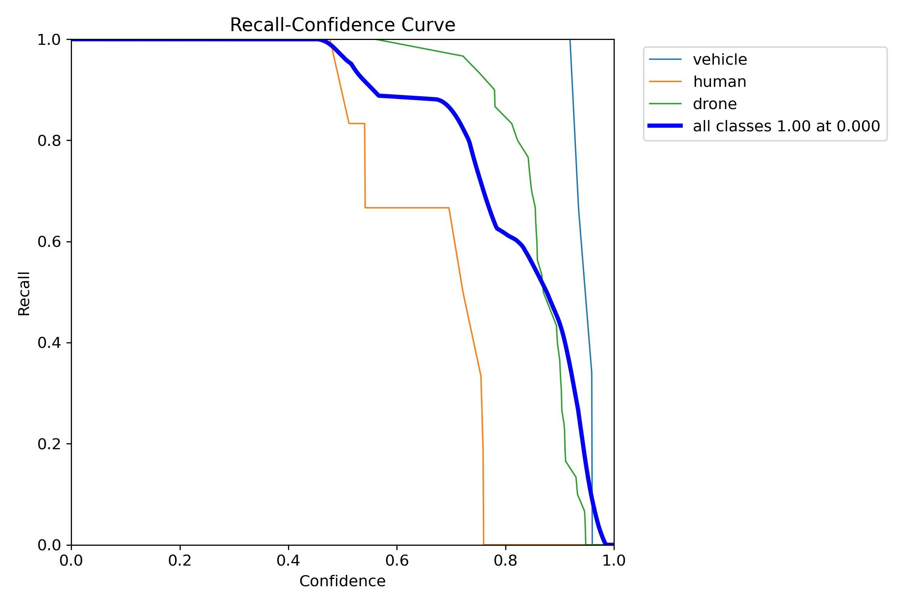
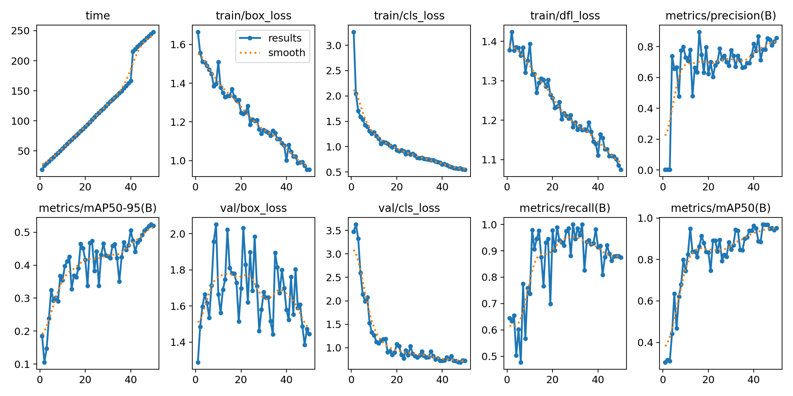

# **Drone Detection Model Using YOLOv11**

## **Project Overview**
This project is a machine learning solution focused on detecting drones using the YOLOv11 architecture. The model has been trained specifically to identify **three classes**: drones, humans, and vehicles, using **thermal imagery**. The ability to detect drones, particularly in low-visibility conditions, is essential for applications such as **border security, airspace monitoring, and threat detection**.

The model has been developed with defense and security applications in mind, where real-time detection and high accuracy are critical. This solution can be deployed in embedded systems for on-the-fly detection and classification of aerial threats, aiding security personnel in responding to unauthorized UAVs.

## **Table of Contents**
1. [Dataset](#dataset)
2. [Model Architecture](#model-architecture)
3. [Performance Metrics](#performance-metrics)
4. [Visual Results](#visual-results)
5. [Evaluation Curves](#evaluation-curves)
6. [Potential Capabilities](#potential-capabilities)

## **[Dataset](https://universe.roboflow.com/korki14/drones-srdze)**

The dataset used for this project consists of **150 thermal images** that include various **UAV (Unmanned Aerial Vehicle)** variants, vehicles, and human subjects. The thermal nature of the images allows the model to function in low-light and night-time conditions, making it highly suitable for surveillance applications.

### Dataset Highlights:
- **Classes**: `drone`, `vehicle`, `human`
- **Total Images**: 150
- **Image Type**: Thermal imagery

## **Model Architecture**

The detection model is based on **YOLOv11**, a robust object detection framework optimized for both speed and accuracy. This architecture, with over **238 layers** and **2.5 million parameters**, is designed to achieve real-time performance while maintaining a high degree of precision.

### Key Features:
- **Real-time Inference**: Capable of processing at **2.44 images/second** on an NVIDIA RTX 3070 Ti.
- **Multiple Class Detection**: Trained to identify up to three distinct classes in a single frame.
- **Thermal Image Adaptation**: Custom pre-processing techniques enhance detection under various thermal conditions.

## **Performance Metrics**

The performance of the model was evaluated using precision, recall, and mean Average Precision (mAP) metrics. The results are as follows:

### **Overall Scores:**
- **Precision**: 0.83
- **Recall**: 0.88
- **mAP@50**: 0.943
- **mAP@50-95**: 0.524

### **Class-wise Performance:**
| Class     | Precision | Recall | mAP@50 | mAP@50-95 |
|-----------|-----------|--------|--------|-----------|
| **Vehicle** | 0.526     | 1.0    | 0.995  | 0.609     |
| **Human**   | 0.964     | 0.667  | 0.839  | 0.389     |
| **Drone**   | 1.0       | 0.975  | 0.995  | 0.575     |

## **Visual Results**

### **Before Detection:**

### **After Detection:**

The model successfully detects multiple objects in the thermal image, distinguishing between drones, humans, and vehicles.

## **Evaluation Curves**

### **F1-Score Curve:**
The F1-Score Curve is a good indicator of the trade-off between precision and recall. The model achieves an **overall F1 score of 0.82**, with the highest performance for drone detection. Lower F1 scores for human and vehicle detection indicate room for improvement in these categories.

### **Precision-Confidence Curve:**
The precision-confidence curve shows that drone detection achieves near-perfect precision (1.0) for most confidence values. Human and vehicle detection exhibit a wider spread, suggesting that these classes are more susceptible to false positives at lower confidence thresholds.

### **Precision-Recall Curve:**
The precision-recall curve is another critical metric for evaluating detection quality. The model achieves an overall **mAP@50 of 0.943**, with drone detection performing the best, followed by vehicles and then humans.

### **Recall-Confidence Curve:**
The recall-confidence curve highlights that the model is highly confident in drone detections, while human and vehicle detections show more variance, implying possible overfitting or a need for additional training data.

### **Training Curves:**
These curves provide insight into the loss reduction and metric improvement over the training epochs.

## **Potential Capabilities**

This model is designed with potential defense applications in mind:

- **Border Security and Surveillance**: Detect and track unauthorized UAVs in restricted airspaces.
- **Perimeter Security**: Monitor and classify aerial objects to differentiate between drones and potential threats.
- **Night-time Operations**: Utilize thermal imagery to provide detection capability in low-visibility conditions.
- **Real-time Threat Analysis**: Deploy the model on real-time systems for immediate detection and classification.

